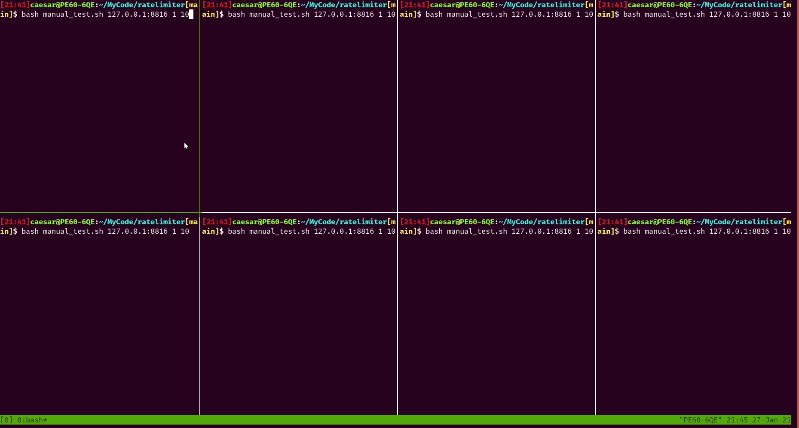
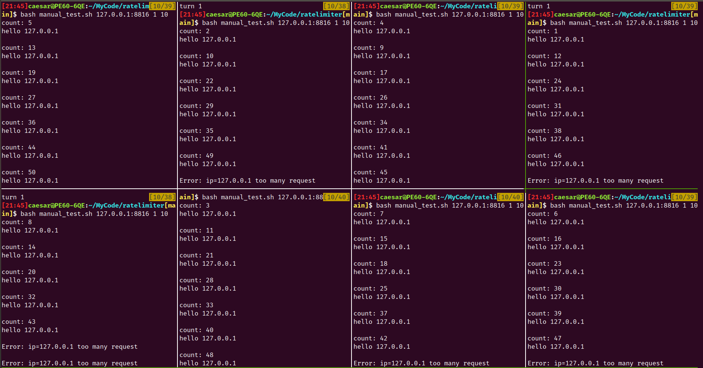

# tutorial

## 需求敘述

實作⼀個 server 並滿⾜以下要求：

- 每個 IP 每分鐘僅能接受 60 個 requests
- 在⾸⾴顯⽰⽬前的 request 量，超過限制的話則顯⽰ “Error”，例如在⼀分鐘內第 30 個 request 則顯⽰ 30，第 61 個 request 則顯⽰ Error 

以下命令  
請都在專案根目錄進行操作  

## 目錄

- [tutorial](#tutorial)
  - [config file](#config-file)
  - [redis server](#redis-server)
    - [啟動](#啟動)
    - [結束](#結束)
  - [rate limiter server](#rate-limiter-server)
    - [local](#local)
    - [redis](#redis)
    - [server run command](#server-run-command)
  - [test](#test)
    - [middleware test](#middleware-test)
    - [limiter test](#limiter-test)
    - [manual test](#manual-test)
  - [範例圖片](#範例圖片)
    - [過程](#過程)
    - [結果](#結果)
  - [build command](#build-command)

## config file

[config.yaml](./config.yaml)

調整設定值  
以便符合 運行環境 或 需求變更  

## redis server

[redis_docker-compose.yml](./deploy/redis/docker-compose.yml)

### 啟動

```bash
docker-compose -f ./deploy/redis/docker-compose.yml up -d
```

---

### 結束

```bash
docker-compose -f ./deploy/redis/docker-compose.yml down -v
```

## rate limiter server

環境變數 `LimiterKind`  
可選下面兩個其中一個  
若沒設置環境變數, 預設使用 local  

### local

  各個 application server  
  在自己的 process memory  
  實現儲存相關限流資訊  

  用於沒有 auto scale 的需求  
  固定 N 個應用伺服器  

  若確定前方的 load balancer 規則  
  每次都可以將相同的 ip  
  導入 同一個 application server  
  就可以使用該類型的 rate limiter  

### redis

  適合用於有 auto scale 的需求  
  應用伺服器 不是固定數量  

  將所有限流資訊集中在同一個地方  
  因為不是太重要的資訊  
  也不需要特別儲存在關聯式資料庫  

  且 redis 將資料儲存在 ram  
  文件 I/O 存取較少  
  大多是在 user space 進行 記憶體操作  
  response 速度快  

### server run command

```bash
LimiterKind=local go run ./cmd/server/server.go
LimiterKind=redis go run ./cmd/server/server.go

LimiterKind=redis ./server_linux
LimiterKind=redis ./server_darwin
LimiterKind=redis ./server_windows.exe
```

## test

### middleware test

[middleware_test.go](./pkg/httpX/middleware_test.go)

在 api middleware 加上 limiter 元件  
進行整合測試  

為了等待 reset count 的觸發  
所以測試時間較久  

```bash
go test -run=Test_LimitIPAccessCount -count=1 github.com/Min-Feng/ratelimiter/pkg/httpX
```

---

### limiter test

[limiter_test.go](./pkg/limiter/limiter_test.go)

limiter 元件 進行併發測試  
分別為  

- LocalLimiter (unit test fast)
- RedisLimiter (unit test slow)

```bash
go test -run=Test_.*Limiter_Allow_count_successful -tags=integration -count=1 -v github.com/Min-Feng/ratelimiter/pkg/limiter
```

```text
=== RUN   Test_LocalLimiter_Allow_count_successful
--- PASS: Test_LocalLimiter_Allow_count_successful (0.01s)
=== RUN   Test_RedisLimiter_Allow_count_successful
--- PASS: Test_RedisLimiter_Allow_count_successful (0.16s)
PASS
```

---

### manual test

[manual_test.sh](./manual_test.sh)

希望可以看到實際的回傳資料  
使用 bash 進行 客戶端 發送 request

需要先手動啟動 limiter application server  
才可進行測試  

第一個參數: domain  
第二個參數: 執行幾回合  
第三個參數: 每回合發送幾次 request  

```bash
bash manual_test.sh 127.0.0.1:8816 1 10

or

chmod 744 ./manual_test.sh
./manual_test.sh 127.0.0.1:8816 100 10
```

## 範例圖片

單一 server 後台執行  
8 個 client 同時發送 10 個 request 共 80 次  

```yaml
# 相關參數
rate_limiter:
  max_limit_count: 50
  reset_count_interval: 2 # seconds
```

### 過程



### 結果



## build command

```bash
GOOS=darwin CGO_ENABLED=0 go build -trimpath -o server_darwin ./cmd/server/server.go

GOOS=linux CGO_ENABLED=0 go build -trimpath -o server_linux ./cmd/server/server.go

GOOS=windows CGO_ENABLED=0 go build -trimpath -o server_windows.exe ./cmd/server/server.go
```
